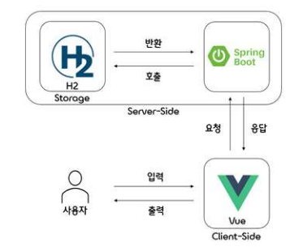
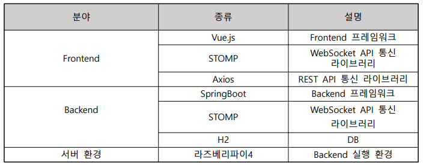
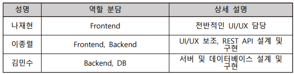
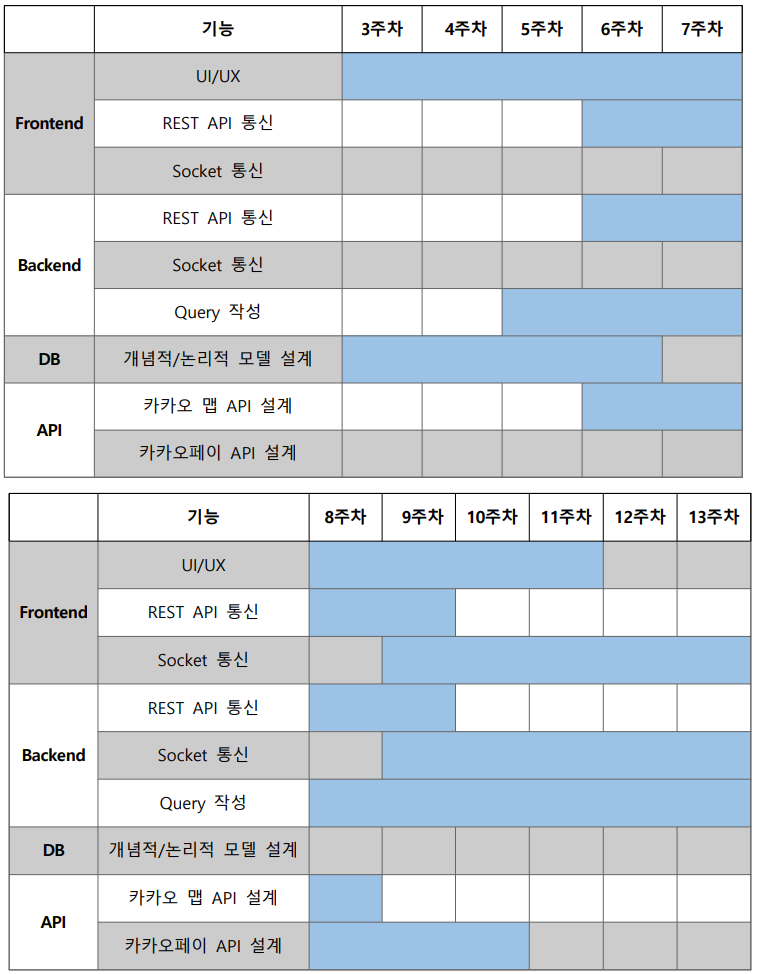

# 창의 설계 프로젝트  졸업 작품💻

- 팀 명: 우리끼리
- 주 제: 공동으로 배달 음식을 주문할 수 있는 시스템

## 시스템 구조도

## 기술 스텍

## 역할 분담

## 개발 일정

---
### Branch Naming Convention
- Frontend Branch: f-(기능)
- Backend Branch: b-(기능)

### 일정
|     |   TO-DO    | Due-Date | done
|-----|:----------:|:--------:|:------:
| 학교  | 캡스톤 결과 보고서 |  17일(금)  | O
| 창설  |   최종 발표    |  21일(화)  | O
| 에지  |   최종 시연    |  21일(화)  | O
| 창설  |   최종 보고서   |  24일(금)  | O
| 에지  |   최종 보고서   |  26일(일)  | O
| 창설  |  자가 진단 평가  |  30일(목)  | O
